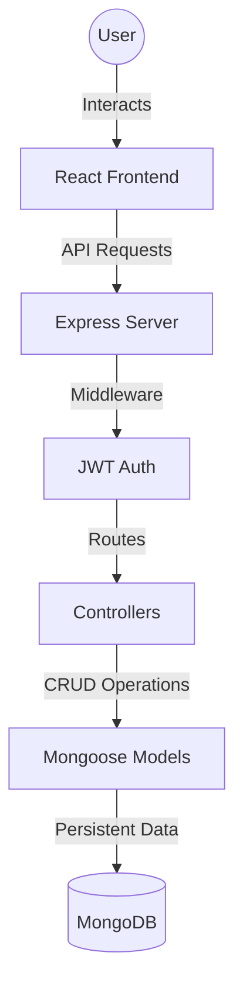

# 💰 FinancePro - Smart Personal Finance Manager

FinancePro is a modern, comprehensive personal finance management tool designed to help you track expenses, visualize income trends, and predict future financial health using AI.

Built with the **MERN Stack** (MongoDB, Express, React, Node.js) and styled with **Ant Design** for a premium, responsive user experience.

---

## 📋 Prerequisites

Before you begin, ensure you have the following installed on your machine. If not, follow the links to download and install them.

### 1. Git (Version Control)
Required to clone the repository.
- **Download**: [git-scm.com](https://git-scm.com/downloads)
- **Verify**: Open your terminal/command prompt and run:
  ```bash
  git --version
  ```

### 2. Node.js (Runtime Environment)
Required to run the backend and build the frontend.
- **Download**: [nodejs.org](https://nodejs.org/) (Download the **LTS** version).
- **Verify**:
  ```bash
  node -v
  npm -v
  ```

### 3. MongoDB (Database)
Required to store user data and transactions.
- **Download**: [MongoDB Community Server](https://www.mongodb.com/try/download/community)
- **Installation Tips**:
  - During installation, choose **"Run service as Network Service user"**.
  - **IMPORTANT**: Check the box **"Install MongoDB Compass"** (a useful GUI for viewing your data).
- **Verify**: Open a terminal and type:
  ```bash
  mongod --version
  ```
  *(Note: If the command isn't found, you may need to add MongoDB to your system PATH, or just ensure the service is running in Windows Services).*

---

## 🚀 Getting Started

Follow these steps to set up the project locally.

### 1. Clone the Repository
Open your terminal (Command Prompt, PowerShell, or Git Bash) and run:
```bash
git clone https://github.com/unnikrishnan-sics/FinancePro.git
cd FinancePro
```

---

### 2. Updating the Project
If you have already cloned the repository and want to pull the latest changes:
```bash
git pull origin main
```
*Note: After pulling, remember to run `npm install` in both `client` and `server` directories if new packages were added.*

---

### 3. Backend Setup (Server)

1.  Navigate to the server directory:
    ```bash
    cd server
    ```
2.  Install dependencies:
    ```bash
    npm install
    ```
3.  **Configure Environment Variables**:
    - Create a new file named `.env` in the `server` folder.
    - Copy the following code into it:
      ```env
      PORT=5000
      MONGO_URI=mongodb://localhost:27017/financepro
      JWT_SECRET=your_super_secret_key_change_this
      NODE_ENV=development
      ```
4.  Start the backend server:
    ```bash
    npm run dev
    ```
    *You should see: "Server running on port 5000" and "MongoDB Connected".*

---

### 4. Frontend Setup (Client)

1.  Open a **new** terminal window (keep the server running in the first one).
2.  Navigate to the client directory:
    ```bash
    cd client
    ```
3.  Install dependencies:
    ```bash
    npm install
    ```
4.  Start the React application:
    ```bash
    npm run dev
    ```
5.  Open your browser and visit:
    ```
    http://localhost:5173
    ```
---

## 🏗️ Project Architecture & Flow

FinancePro follows a classic **MERN** architecture with a clear separation of concerns:



### Request Flow:
1.  **Frontend**: User actions (like adding an expense) trigger an API call.
2.  **API Layer**: The request hits an Express route (e.g., `/api/v1/transactions`).
3.  **Middleware**: For protected routes, JWT tokens are verified.
4.  **Controller**: The logic (e.g., `addTransaction`) processes data and interacts with the Model.
5.  **Database**: Mongoose ensures data integrity and saves the record to MongoDB.
6.  **Response**: The server sends back a JSON response to update the UI via Redux/State.

---

## 📦 User Modules & Functions

### 1. Authentication Module (`authController.js`)
Handles user lifecycle and security.
- **`registerUser`**: Creates new user accounts.
- **`loginUser`**: Authenticates users and returns a JWT.
- **`updateUserProfile`**: Allows users to change name, email, password, and spending thresholds.
- **`forgotPassword` / `resetPassword`**: Secure email-based recovery flow.

### 2. Transaction Module (`transactionController.js`)
The core of the financial tracking system.
- **`addTransaction`**: Records income or expenses. Includes logic for **High-Value Alerts**.
- **`getAllTransactions`**: Fetches user-specific history.
- **`deleteTransaction`**: Safely removes records.

### 3. Analytics & Predictive Module (`analyticsController.js`)
Uses AI and math to provide financial insights.
- **`getAnalyticsData`**: 
    - **Linear Regression**: Predicts next month's spending based on history.
    - **Anomaly Detection**: Identifies spikes in specific categories.
    - **Recommendations**: Provides smart tips (e.g., "You spent 50% more on Food this month").

### 4. Admin Module (`adminController.js`)
System-wide oversight for authorized personnel.
- **`getAllUsers`**: Monitors user growth.
- **`getGlobalStats`**: Unified view of total system throughput.
- **`getSystemAnalytics`**: High-level spending trends across the entire platform.

### 5. Notification Module
- Automated alerts for high-value transactions based on user-defined thresholds.

---

## 🛠️ Tech Stack

- **Frontend**: React.js, Vite, Ant Design (UI Library), Recharts.
- **Backend**: Node.js, Express.js.
- **Database**: MongoDB (Mongoose ODM).
- **Authentication**: JWT (JSON Web Tokens).

## 🔑 Default Login
You can register a new account, or use these credentials if you seeded the database:
- **Email**: `admin@gmail.com`
- **Password**: `admin@123`

---

## 🤝 Contributing
1. Fork the Project
2. Create your Feature Branch (`git checkout -b feature/AmazingFeature`)
3. Commit your Changes (`git commit -m 'Add some AmazingFeature'`)
4. Push to the Branch (`git push origin feature/AmazingFeature`)
5. Open a Pull Request
